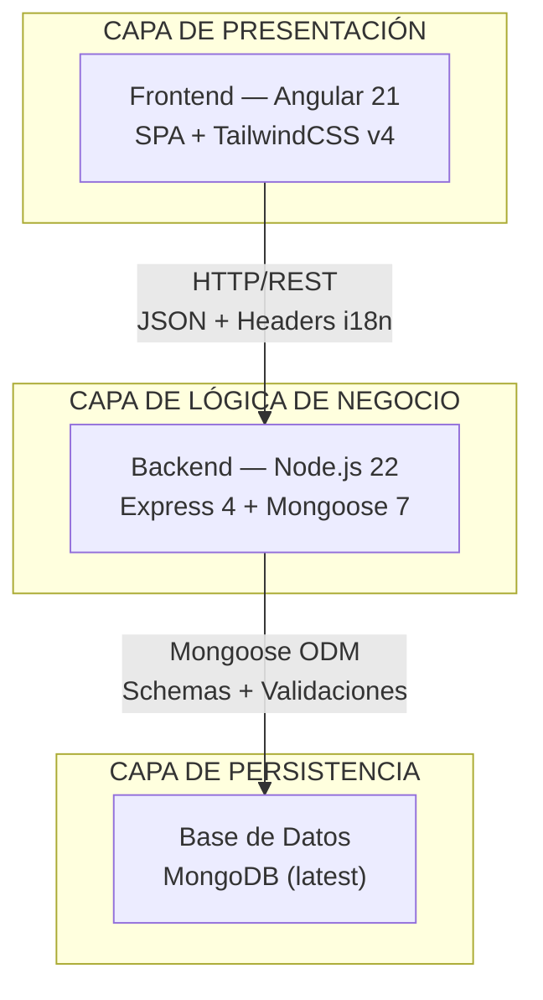
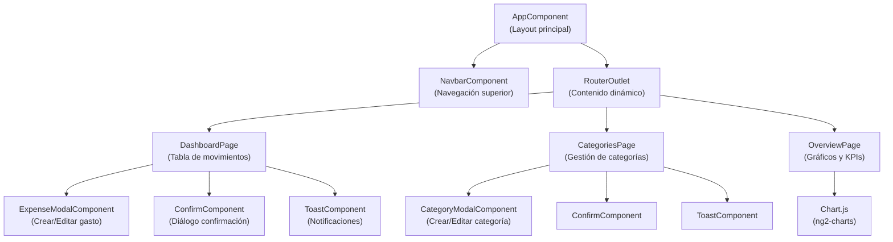
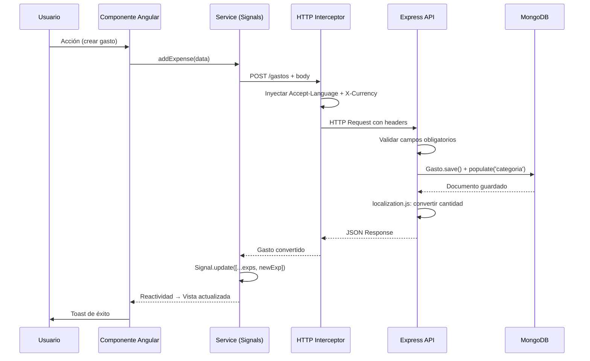
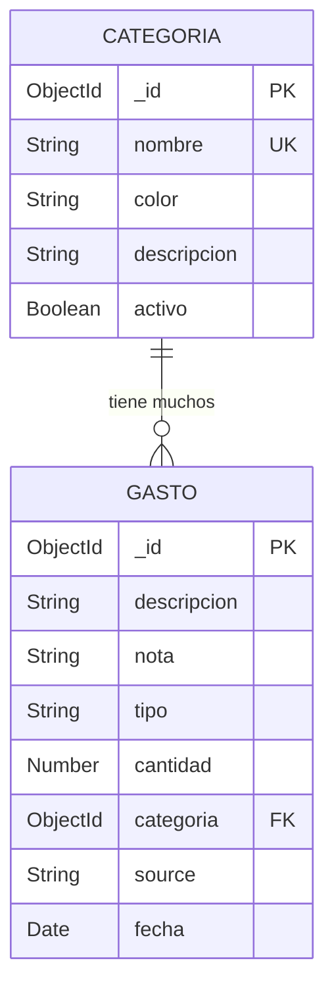
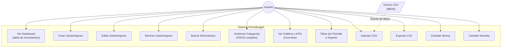
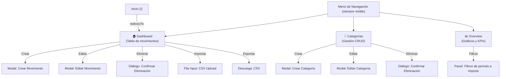

# HOMEBUDGET

## MEMORIA DEL PROYECTO INTERMODULAR

**IES San Vicente — 2.º DAW**

**Autores:** Jorge Sánchez González · Pablo Fernández

**Curso Académico:** 2025 – 2026

---

## Índice

1. [Introducción y Objetivos](#1-introducción-y-objetivos)
   - 1.1 [Descripción del Problema](#11-descripción-del-problema)
   - 1.2 [Descripción de la Solución Aportada](#12-descripción-de-la-solución-aportada)
   - 1.3 [Motivación](#13-motivación)
2. [Antecedentes y Estado del Arte](#2-antecedentes-y-estado-del-arte)
   - 2.1 [Análisis de Soluciones Previas](#21-análisis-de-soluciones-previas)
   - 2.2 [Estado del Arte](#22-estado-del-arte)
3. [Análisis de Requisitos](#3-análisis-de-requisitos)
   - 3.1 [Descripción Detallada de la Funcionalidad](#31-descripción-detallada-de-la-funcionalidad)
   - 3.2 [Requisitos](#32-requisitos)
4. [Diseño](#4-diseño)
   - 4.1 [Metodología de Desarrollo Elegida](#41-metodología-de-desarrollo-elegida)
   - 4.2 [Descripción de Módulos y Componentes Principales](#42-descripción-de-módulos-y-componentes-principales)
   - 4.3 [Diagrama de Casos de Uso](#43-diagrama-de-casos-de-uso)
   - 4.4 [Modelo Entidad-Relación (ER) y Modelo Relacional](#44-modelo-entidad-relación-er-y-modelo-relacional)
   - 4.5 [Diseño de la Interfaz](#45-diseño-de-la-interfaz)
5. [Implementación](#5-implementación)
   - 5.1 [Stack Tecnológico](#51-stack-tecnológico)
   - 5.2 [Estructura del Proyecto](#52-estructura-del-proyecto)
   - 5.3 [Backend — Desarrollo de la API REST](#53-backend--desarrollo-de-la-api-rest)
   - 5.4 [Frontend — Desarrollo de la SPA](#54-frontend--desarrollo-de-la-spa)
   - 5.5 [Internacionalización (i18n)](#55-internacionalización-i18n)
   - 5.6 [Conversión de Moneda en Tiempo Real](#56-conversión-de-moneda-en-tiempo-real)
   - 5.7 [Importación y Exportación de Datos CSV](#57-importación-y-exportación-de-datos-csv)
   - 5.8 [Contenerización con Docker](#58-contenerización-con-docker)
   - 5.9 [Gestión de Estado Reactiva con Angular Signals](#59-gestión-de-estado-reactiva-con-angular-signals)
6. [Conclusiones](#6-conclusiones)
   - 6.1 [Conclusiones del Trabajo Realizado](#61-conclusiones-del-trabajo-realizado)
   - 6.2 [Trabajos Futuros](#62-trabajos-futuros)
7. [Bibliografía](#7-bibliografía)

---

## 1. Introducción y Objetivos

### 1.1 Descripción del Problema

Los usuarios domésticos reciben regularmente extractos bancarios en formatos poco intuitivos (CSV, Excel, PDF) procedentes de sus entidades financieras. Estos documentos presentan las siguientes deficiencias:

- **Columnas técnicas** y difíciles de interpretar para el usuario no especializado.
- **Conceptos ambiguos** en las descripciones de movimientos bancarios.
- **Estructura poco práctica** para realizar análisis agregados de gastos e ingresos.
- **Volúmenes de datos extensos** que resultan abrumadores sin herramientas de filtrado y visualización.

Adicionalmente, existe una creciente preocupación entre los usuarios respecto a la **privacidad y seguridad** al utilizar aplicaciones financieras que centralizan y procesan datos bancarios en servidores de terceros. Esto genera una brecha entre la necesidad de herramientas visuales de análisis financiero y la desconfianza hacia soluciones que requieren compartir información sensible.

### 1.2 Descripción de la Solución Aportada

**HomeBudget** es una aplicación web de gestión de finanzas personales que permite:

1. **Importación y transformación de datos**: Procesar extractos bancarios del BBVA en formato CSV, convirtiéndolos en un modelo de datos normalizado y comprensible.
2. **Gestión interactiva de movimientos**: Visualizar, crear, editar y eliminar transacciones financieras (gastos e ingresos) a través de una interfaz clara e intuitiva.
3. **Categorización de movimientos**: Organizar transacciones en categorías personalizables (Alimentación, Transporte, Entretenimiento, etc.) para facilitar el análisis.
4. **Análisis visual mediante gráficos**: Mostrar la distribución y evolución de gastos con gráficos interactivos (pie chart, gráfico de líneas) que permiten filtrado por período, categoría y tipo de movimiento.
5. **Exportación de datos**: Permitir la descarga de la información financiera en formato CSV para su uso externo.
6. **Procesamiento local**: Todos los datos se procesan y almacenan en un entorno controlado mediante contenedores Docker, garantizando la privacidad.
7. **Multiidioma y multimoneda**: Soporte completo para español e inglés, con conversión dinámica entre EUR, USD y GBP.

### 1.3 Motivación

La creación de HomeBudget responde a la necesidad de ofrecer una solución que combine varios beneficios clave:

- **Seguridad y privacidad**: Los datos nunca abandonan el entorno controlado del usuario, sin depender de servidores externos ni APIs bancarias de terceros.
- **Facilidad de uso**: Convertir extractos bancarios complejos en información visual, clara y accionable, accesible para usuarios no técnicos.
- **Escalabilidad conceptual**: El MVP actual proporciona una base sólida para futuras expansiones (integración con múltiples bancos, análisis avanzados, presupuestos automáticos).
- **Autonomía del usuario**: Control total sobre los datos y procesos sin necesidad de intermediarios.
- **Proyecto formativo integrador**: Aplicación práctica de los conocimientos adquiridos durante el ciclo de DAW, integrando desarrollo frontend, backend, bases de datos NoSQL y despliegue con contenedores.

---

## 2. Antecedentes y Estado del Arte

### 2.1 Análisis de Soluciones Previas

| Solución | Características principales | Limitaciones |
|---|---|---|
| **Fintonic** | Categorización automática de gastos, análisis detallado, alertas de fraude, integración con bancos españoles | Requiere sincronización con cuentas bancarias (envío de credenciales a servidores), política de privacidad menos transparente, dependencia de servidores externos |
| **MoneyWiz** | Sincronización multi-cuenta, presupuestos personalizables, reportes detallados, multiplataforma | Modelo de suscripción para acceso completo, sincronización con terceros, interfaz compleja para usuarios no técnicos |
| **Mint** (Intuit) | Referente en gestión de finanzas personales con categorización automática y análisis avanzados | Discontinuada por Intuit en 2024 en EE.UU., migración forzada a Credit Karma, historial de cambios de políticas que afectaron a usuarios |
| **Excel / Google Sheets** | Completamente personalizable, sin coste adicional | Completamente manual, sin visualización automática, requiere conocimientos técnicos |
| **Apps bancarias nativas** | Acceso directo a los datos de la cuenta | Limitadas a un único banco, interfaces no optimizadas para análisis comparativos |

### 2.2 Estado del Arte

**Situación actual del mercado:**

1. **Tendencia hacia la privacidad**: Creciente demanda de herramientas que eviten el envío de datos a terceros. Productos como Nextcloud o soluciones open-source ganan tracción.
2. **Visualización como diferenciador**: Las aplicaciones modernas priorizan dashboards intuitivos, gráficos interactivos y reportes automáticos sobre interfaces complejas.
3. **Modelos híbridos**: Mezcla de aplicaciones web (acceso desde cualquier navegador) con opciones de datos locales o sincronización opcional.
4. **Estandarización de formatos**: Los bancos comienzan a estandarizar la exportación de datos (formatos CSV, OFX), reduciendo fricción en la importación.
5. **Stack tecnológico predominante**: JavaScript fullstack (Node.js + Express en backend, Angular/React/Vue en frontend) se ha consolidado como el estándar para aplicaciones financieras web modernas.

**Conclusión**: Existe un nicho de mercado poco saturado para aplicaciones financieras personales que prioricen la privacidad, sean auto-alojables y compartan la filosofía de "datos bajo control del usuario".

---

## 3. Análisis de Requisitos

### 3.1 Descripción Detallada de la Funcionalidad

La solución HomeBudget se estructura en torno a cinco módulos funcionales principales:

#### 3.1.1 Módulo de Dashboard (Visualización General)

- Visualización de tabla interactiva con todos los movimientos registrados.
- Columnas: Fecha, Concepto (Descripción), Nota, Tipo, Cantidad, Categoría, Origen.
- Ordenamiento por cualquier columna.
- Barra de búsqueda con filtrado en tiempo real por texto.
- Resumen visual del saldo total y gastos del período actual.
- Acceso rápido a acciones (crear nuevo movimiento, editar, eliminar).
- Estado vacío (empty state) con call-to-action para guiar al usuario.

#### 3.1.2 Módulo de Gestión de Gastos e Ingresos

- Crear nuevos movimientos manualmente con campos: descripción, nota, tipo (ingreso/gasto), cantidad, categoría asignada, fecha y origen.
- Editar movimientos existentes a través de modal de edición con pre-carga de datos.
- Eliminar movimientos con diálogo de confirmación previo.
- Validación de datos en frontend y backend (campos obligatorios, formato numérico).

#### 3.1.3 Módulo de Categorías

- Visualización de lista de categorías disponibles con indicador visual de color.
- Crear nuevas categorías con: nombre, descripción, color y estado (activo/inactivo).
- Editar categorías existentes.
- Eliminar categorías (con validación: no se puede eliminar si hay gastos asociados).
- Estado vacío con guía para crear la primera categoría.

#### 3.1.4 Módulo de Análisis (Overview — Gráficos y Reportes)

- KPIs financieros: Ingresos totales, Gastos totales, Balance neto, Tasa de ahorro.
- Gráfico de distribución de gastos por categoría (donut chart / pie chart) con colores de categoría.
- Gráfico de evolución temporal de finanzas (line chart) con series para ingresos y gastos.
- Filtros avanzados: período de tiempo (Este mes, Últimos 3 meses, Este año, Rango personalizado), importe mínimo/máximo.
- Estados vacíos informativos cuando no hay datos para el período seleccionado.

#### 3.1.5 Módulo de Importación/Exportación

- Importar archivos CSV (formato BBVA con separador `;`), transformando columnas en campos del modelo interno.
- Creación automática de categorías no existentes durante la importación.
- Validación de datos importados (detección de filas inválidas, validación de tipos numéricos).
- Conversión automática de formato de fecha (`dd/mm/yyyy` → `yyyy-mm-dd`).
- Exportar todos los movimientos registrados a formato CSV con encoding UTF-8 + BOM para compatibilidad con Excel.

### 3.2 Requisitos

#### 3.2.1 Requisitos Funcionales

| ID | Requisito | Descripción | Prioridad | Implementado |
|---|---|---|---|---|
| RF1 | Visualización de movimientos | El dashboard debe mostrar una tabla con todos los gastos e ingresos registrados, permitiendo ordenar por columnas | ALTA | ✅ Sí |
| RF2 | Crear gasto/ingreso | El usuario debe poder añadir nuevos movimientos mediante modal con campos: descripción, nota, tipo, cantidad, categoría, fecha, origen | ALTA | ✅ Sí |
| RF3 | Editar gasto/ingreso | El usuario debe poder editar movimientos existentes a través de una modal de edición | ALTA | ✅ Sí |
| RF4 | Eliminar gasto/ingreso | El usuario debe poder eliminar movimientos con confirmación previa | ALTA | ✅ Sí |
| RF5 | Visualizar categorías | El sistema debe mostrar un listado de todas las categorías disponibles | ALTA | ✅ Sí |
| RF6 | Crear categoría | El usuario debe poder crear nuevas categorías con nombre, descripción, color e icono | MEDIA | ✅ Sí |
| RF7 | Editar categoría | El usuario debe poder editar categorías existentes | MEDIA | ✅ Sí |
| RF8 | Eliminar categoría | El usuario debe poder eliminar categorías (si no tienen gastos asociados) | MEDIA | ✅ Sí |
| RF9 | Filtrado de gastos | El usuario debe poder aplicar filtros por período de tiempo e importe | MEDIA | ✅ Sí |
| RF10 | Visualización de gráficos | El sistema debe generar gráficos de distribución y evolución con KPIs financieros | MEDIA | ✅ Sí |
| RF11 | Importar CSV | El usuario debe poder cargar archivos CSV que se transforman en gastos con auto-creación de categorías | MEDIA | ✅ Sí |
| RF12 | Exportar datos | El usuario debe poder descargar los gastos registrados en formato CSV | BAJA | ✅ Sí |
| RF13 | Navegación | El sistema debe disponer de menú de navegación para acceder a todas las secciones | ALTA | ✅ Sí |
| RF14 | Notificaciones | El sistema debe mostrar notificaciones (toast) de éxito/error en operaciones | MEDIA | ✅ Sí |

#### 3.2.2 Requisitos No Funcionales

| ID | Requisito | Descripción | Prioridad | Implementado |
|---|---|---|---|---|
| RNF1 | Rendimiento | El sistema debe responder a peticiones en menos de 2 segundos en condiciones normales | ALTA | ✅ Sí |
| RNF2 | Responsividad | La interfaz debe adaptarse correctamente a dispositivos de diferentes tamaños (desktop, tablet, móvil) | ALTA | ⚠️ Parcial |
| RNF3 | Usabilidad | La interfaz debe ser intuitiva sin requerir documentación compleja; apta para usuarios no técnicos | ALTA | ✅ Sí |
| RNF4 | Persistencia | Todos los datos deben almacenarse en base de datos MongoDB y ser recuperables tras cerrar sesión | ALTA | ✅ Sí |
| RNF5 | Privacidad | Los datos deben procesarse y almacenarse localmente sin enviar información a servidores de terceros | ALTA | ✅ Sí |
| RNF6 | Compatibilidad | La aplicación debe funcionar en navegadores modernos (Chrome, Firefox, Safari, Edge) versiones recientes | MEDIA | ✅ Sí |
| RNF7 | Mantenibilidad | El código debe estructurarse en módulos reutilizables, con comentarios y documentación | MEDIA | ⚠️ Parcial |
| RNF8 | Seguridad | Las validaciones en frontend deben replicarse en backend; sanitización de inputs | MEDIA | ⚠️ Parcial |
| RNF9 | Escalabilidad | La arquitectura debe permitir futuras ampliaciones (nuevos módulos, nuevas fuentes de datos) | BAJA | ✅ Sí |
| RNF10 | Internacionalización | La interfaz debe soportar múltiples idiomas (español e inglés) y monedas (EUR, USD, GBP) | BAJA | ✅ Sí |

---

## 4. Diseño

### 4.1 Metodología de Desarrollo Elegida

**Metodología Seleccionada: Kanban**

**Justificación:**

1. **Visualización continua**: Kanban permite visualizar el flujo de trabajo (To Do → In Progress → Done) de forma clara, identificando cuellos de botella mediante un tablero Trello compartido.
2. **Adaptabilidad**: Permite cambios de requisitos sin necesidad de replanificación periódica, ideal para un proyecto con requisitos que evolucionan.
3. **WIP Limit**: Establece límites de trabajo en curso, evitando sobrecarga y mejorando la calidad del código.
4. **Iteraciones continuas**: Facilita entregas incrementales y feedback temprano sin esperar a fin de sprint.
5. **Menos overhead**: Requiere menos ceremonias que Scrum, permitiendo a los desarrolladores enfocarse en la implementación.
6. **Adecuación al proyecto**: Perfecto para desarrollo en equipo pequeño (dos personas) con prioridades cambiantes.

**Herramientas de gestión utilizadas:**
- **Trello**: Tablero Kanban con columnas To Do, In Progress, Testing, Done.
- **Git + GitHub**: Control de versiones con ramas por funcionalidad (feature branches).

### 4.2 Descripción de Módulos y Componentes Principales

#### 4.2.1 Arquitectura General: Three-Tier Architecture



La aplicación sigue una arquitectura de **tres capas** claramente diferenciadas, conectadas mediante una API REST y desplegadas como microservicios mediante Docker Compose:

| Capa | Tecnología | Puerto | Responsabilidad |
|---|---|---|---|
| Presentación | Angular 21 + Nginx | 80 | Interfaz de usuario, lógica de presentación, routing SPA |
| Lógica de Negocio | Node.js + Express 4 | 5000 | API REST, validaciones, transformaciones, CSV I/O |
| Persistencia | MongoDB | 27017 | Almacenamiento documental, índices, referencias |

#### 4.2.2 Backend (Node.js + Express)

**Ubicación**: `back/`

**Componentes:**

1. **Punto de entrada** (`app.js`)
   - Configuración de Express con middlewares (CORS, body-parser, localization).
   - Conexión a MongoDB mediante Mongoose.
   - Definición de 9 rutas REST.
   - Configuración de Multer para carga de archivos CSV (límite 5 MB, validación MIME `text/csv`).

2. **Controladores** (`controllers/`)
   - `gastoController.js`: Lógica de importación CSV (lectura stream, parseo con `csv-parser`, auto-creación de categorías, conversión de fecha) y exportación CSV (generación con PapaParse, encoding UTF-8 BOM).

3. **Modelos** (`models/`)
   - `Gasto.js`: Esquema de movimiento financiero con campos: `descripcion`, `nota`, `tipo`, `cantidad`, `categoria` (referencia ObjectId), `source`, `fecha`.
   - `Categoria.js`: Esquema de categoría con campos: `nombre` (unique), `color`, `descripcion`, `activo`.

4. **Middlewares** (`middlewares/`)
   - `localization.js`: Middleware de conversión de moneda que intercepta `res.json()` para transformar automáticamente el campo `cantidad` según el header `X-Currency` (EUR, USD, GBP con tasas definidas).

**Rutas API REST:**

| Método | Ruta | Descripción | Validación |
|---|---|---|---|
| `GET` | `/gastos` | Listar gastos (con filtros opcionales: categoría, cantidad, fechas) | — |
| `POST` | `/gastos` | Crear nuevo gasto | Campos obligatorios + Populate categoría |
| `PUT` | `/gastos/:id` | Actualizar gasto existente | Campos obligatorios + Not Found |
| `DELETE` | `/gastos/:id` | Eliminar gasto | Not Found |
| `GET` | `/categorias` | Listar todas las categorías | — |
| `POST` | `/categorias` | Crear nueva categoría | Nombre obligatorio + Duplicados |
| `PUT` | `/categorias/:id` | Actualizar categoría | Nombre obligatorio + Not Found |
| `DELETE` | `/categorias/:id` | Eliminar categoría | Not Found |
| `POST` | `/cargarCsv` | Importar archivo CSV (multipart/form-data) | Archivo requerido + MIME type |
| `GET` | `/descargarCsv` | Descargar todos los gastos en CSV | — |

#### 4.2.3 Frontend (Angular 21)

**Ubicación**: `front/src/`

**Estructura de componentes:**



1. **Componentes de Página** (`pages/`)
   - **Dashboard** (`dashboard/`): Vista principal con tabla interactiva de gastos, búsqueda, acciones rápidas (crear, editar, eliminar) y botones de importación/exportación CSV.
   - **Categories** (`categories/`): Gestión completa de categorías con listado, indicadores de color, modales para CRUD.
   - **Overview** (`overview/`): Análisis visual con KPIs (ingresos, gastos, balance neto, tasa de ahorro), gráficos de distribución (donut) y evolución temporal (línea), filtros por período e importe.

2. **Componentes Compartidos** (`components/`)
   - **Navbar**: Barra de navegación superior con logo, enlaces de routing y selector de idioma/moneda.
   - **Expense Modal**: Modal para crear/editar movimientos con formulario validado.
   - **Category Modal**: Modal para crear/editar categorías con color picker.
   - **Toast**: Sistema de notificaciones flotantes con tipos (success, error, info) y auto-dismiss.
   - **Confirm**: Diálogo modal de confirmación para acciones destructivas (eliminación).

3. **Servicios** (`services/`)
   - `ExpenseService`: Gestión reactiva del estado de gastos mediante Angular Signals. Comunicación HTTP con la API, recarga automática al cambiar idioma/moneda.
   - `CategoryService`: Gestión reactiva del estado de categorías con Signals. CRUD completo contra la API.
   - `ConfigService`: Servicio singleton de configuración global. Gestiona idioma (es/en), moneda (EUR/USD/GBP), traducciones síncronas en memoria y persistencia en `localStorage`.

4. **Interceptores** (`interceptors/`)
   - `configInterceptor`: Interceptor funcional (HttpInterceptorFn) que inyecta automáticamente los headers `Accept-Language` y `X-Currency` en cada petición HTTP saliente.

5. **Pipes** (`pipes/`)
   - `TranslatePipe`: Pipe impuro (`pure: false`) que traduce claves de texto utilizando el diccionario del `ConfigService`, reaccionando automáticamente a cambios de idioma.

6. **Configuración**
   - `app.routes.ts`: Tres rutas principales (`/dashboard`, `/categories`, `/overview`) con redirección por defecto a `/dashboard`.
   - `app.config.ts`: Configuración de providers: Router, HttpClient con interceptores, ng2-charts.

**Flujo de datos:**



#### 4.2.4 Base de Datos (MongoDB)

**Colecciones principales:**

**Colección: `categorias`**

```json
{
  "_id": "ObjectId",
  "nombre": "String (UNIQUE, requerido)",
  "color": "String (opcional, ej: '#FF5733')",
  "descripcion": "String (opcional)",
  "activo": "Boolean (default: true)",
  "__v": "Number (version key de Mongoose)"
}
```

**Índices:**
- `{ nombre: 1 }` — UNIQUE (evita categorías duplicadas)

**Colección: `gastos`**

```json
{
  "_id": "ObjectId",
  "descripcion": "String (requerido)",
  "nota": "String (opcional)",
  "tipo": "String (opcional, valores: 'ingreso' | 'gasto')",
  "cantidad": "Number (requerido)",
  "categoria": "ObjectId (ref: 'Categoria', requerido)",
  "source": "String (requerido, default: 'Unknown')",
  "fecha": "Date (default: Date.now)",
  "__v": "Number"
}
```

**Índices:**
- `{ categoria: 1 }` — Para búsquedas y populate por categoría
- `{ fecha: 1 }` — Para filtrado por rango de fechas

**Relación Categoría → Gasto:**
- **Tipo**: 1:N (One-to-Many)
- **Cardinalidad**: Una categoría puede tener múltiples gastos; cada gasto pertenece a exactamente una categoría.
- **Integridad referencial**: La referencia se gestiona mediante `ObjectId` con `ref: 'Categoria'` y `populate()` en las consultas.
- **Foreign Key**: `Gasto.categoria` referencia `Categoria._id`.



### 4.3 Diagrama de Casos de Uso



### 4.4 Modelo Entidad-Relación (ER) y Modelo Relacional

*Véase el diagrama ER en la sección 4.2.4 (generado con Mermaid).*

#### 4.4.1 Descripción de Relaciones

**Relación Categoría ↔ Gasto:**

- **Tipo**: 1:N (One-to-Many)
- **Cardinalidad**: Una categoría puede tener múltiples gastos; cada gasto pertenece a exactamente una categoría.
- **Integridad**: Restricción de eliminación — no se debe eliminar una categoría que tenga gastos asociados (validación a nivel de aplicación).
- **Foreign Key**: `Gasto.categoria` referencia `Categoria._id`.

### 4.5 Diseño de la Interfaz

#### 4.5.1 Wireframes de Pantallas Principales

**Pantalla Dashboard (Pantalla Principal — Gestión de Movimientos)**

```
┌──────────────────────────────────────────────────────────────────┐
│  HOMEBUDGET             [🏠 Dashboard] [📂 Cat] [📊 Overview]   │
│                                        [🌐 ES/EN] [💱 EUR/USD]  │
├──────────────────────────────────────────────────────────────────┤
│                                                                  │
│  MIS TRANSACCIONES    [➕ Añadir] [📥 Importar] [📤 Exportar]  │
│                                                                  │
│  🔍 Buscar transacciones...                                     │
│                                                                  │
├──────────┬────────────────┬────────┬─────────┬────────┬─────────┤
│ Fecha ▼  │ Concepto       │ Nota   │ Tipo ▼  │ Cant.  │ Categ.  │
├──────────┼────────────────┼────────┼─────────┼────────┼─────────┤
│ 15/05/26 │ Supermercado   │ Compra │ 🔴 Gasto│ €45.50 │ 🟠 Alim │
│ 14/05/26 │ Gasolina       │ Llenar │ 🔴 Gasto│ €65.00 │ 🔵 Trans│
│ 13/05/26 │ Nómina         │ Trabajo│ 🟢 Ingr.│ €2500  │ 💼 Ingr │
│ 12/05/26 │ Electricidad   │ Recibo │ 🔴 Gasto│ €125.00│ ⚡ Serv │
│                                                                  │
│  Acciones por fila: [✏️ Editar] [🗑️ Eliminar] (hover)           │
│                                                                  │
└──────────────────────────────────────────────────────────────────┘
```

**Pantalla Categorías**

```
┌──────────────────────────────────────────────────────────────────┐
│  HOMEBUDGET              [🏠 Dashboard] [📂 Cat] [📊 Overview]  │
├──────────────────────────────────────────────────────────────────┤
│                                                                  │
│  MIS CATEGORÍAS                          [➕ Nueva Categoría]    │
│                                                                  │
│ ┌──────────┬────────────────┬────────────────┬──────────────┐    │
│ │ Color    │ Nombre         │ Descripción    │ Acciones     │    │
│ ├──────────┼────────────────┼────────────────┼──────────────┤    │
│ │ 🟠       │ Alimentación   │ Comida/bebida  │ ✏️ 🗑️       │   │
│ │ 🔵       │ Transporte     │ Gasolina/bus   │ ✏️ 🗑️       │   │
│ │ 🟣       │ Entretenimiento│ Ocio           │ ✏️ 🗑️       │   │
│ │ 🔴       │ Servicios      │ Luz, agua...   │ ✏️ 🗑️       │   │
│ │ 🟢       │ Salud          │ Farmacia ...   │ ✏️ 🗑️       │   │
│ └──────────┴────────────────┴────────────────┴──────────────┘    │
│                                                                  │
└──────────────────────────────────────────────────────────────────┘
```

**Pantalla Overview (Análisis y Gráficos)**

```
┌─────────────────────────────────────────────────────────────────┐
│  HOMEBUDGET              [🏠 Dashboard] [📂 Cat] [📊 Overview] │
├─────────────────────────────────────────────────────────────────┤
│                                                                 │
│  RESUMEN DE FINANZAS                                            │
│                                                                 │
│  📅 Período: [Todo ▼] [Este Mes] [3 Meses] [Este Año] [Custom]  │
│  💰 Importe Mín: [____]    Importe Máx: [____]                  │
│                                                                 │
│  ┌────────────┐ ┌────────────┐ ┌────────────┐ ┌────────────┐    │
│  │  €3,300.50 │ │  €850.00   │ │  €2,450.50 │ │   74.2%    │    │
│  └────────────┘ └────────────┘ └────────────┘ └────────────┘    │
│                                                                 │
│  ┌─────────────────────┐        ┌─────────────────────┐         │
│  │ Distribución Gastos │        │ Evolución Temporal  │         │
│  │ 🥧 (Donut Chart)    │        │ 📈 (Line Chart)     │        │
│  │ Alimentación: 40%   │        │ May: €850           │         │
│  │ Transporte:  25%    │        │ Apr: €620           │         │
│  │ Servicios:   20%    │        │ Mar: €780           │         │
│  │ Entretenimiento: 15%│        │                     │         │
│  └─────────────────────┘        └─────────────────────┘         │
│                                                                 │
└─────────────────────────────────────────────────────────────────┘
```

#### 4.5.2 Flujo de Navegación



---

## 5. Implementación

### 5.1 Stack Tecnológico

| Capa | Tecnología | Versión | Justificación |
|---|---|---|---|
| **Frontend** | Angular | 21.x | Framework SPA maduro con soporte nativo de Signals, standalone components y tipado TypeScript. Última versión estable con mejoras de rendimiento y DX. |
| **CSS Framework** | TailwindCSS | 4.x | Framework utility-first con compilación JIT, configuración PostCSS. Permite prototipado rápido y consistencia visual. |
| **Gráficos** | Chart.js + ng2-charts | 4.5 / 8.0 | Librería ligera y flexible para gráficos interactivos (donut, línea), con wrapper Angular oficial. |
| **Testing Frontend** | Vitest | 4.x | Framework de testing rápido y compatible con el ecosistema Vite/ESM moderno. |
| **Backend** | Node.js + Express | 22 / 4.x | Runtime JavaScript con framework HTTP minimalista. Ecosistema de middleware extenso. |
| **ODM** | Mongoose | 7.x | Object Document Mapper para MongoDB con esquemas, validaciones y populate. |
| **CSV Processing** | csv-parser + PapaParse | 3.x / 5.x | `csv-parser` para lectura streaming de CSVs; PapaParse para generación/serialización. |
| **File Upload** | Multer | 2.x | Middleware Express para manejo de `multipart/form-data` con límites de tamaño y filtro MIME. |
| **Base de Datos** | MongoDB | latest | Base de datos documental NoSQL. Esquema flexible ideal para datos financieros con estructura variable. |
| **Contenedores** | Docker + Docker Compose | — | Orquestación de 3 servicios (frontend, backend, MongoDB) con networking y volúmenes persistentes. |
| **Servidor Web Prod.** | Nginx | Alpine | Servidor de archivos estáticos para la build de producción de Angular. |
| **Control de Versiones** | Git + GitHub | — | Repositorio remoto con historial de cambios y colaboración. |

### 5.2 Estructura del Proyecto

```
proyecto-intermodular/
├── docker-compose.yml          # Orquestación de 3 servicios
├── .gitignore
│
├── back/                       # Servidor API REST
│   ├── Dockerfile              # Node 18-alpine
│   ├── package.json
│   ├── app.js                  # Punto de entrada Express (221 líneas)
│   ├── controllers/
│   │   └── gastoController.js  # Lógica CSV import/export (119 líneas)
│   ├── models/
│   │   ├── Gasto.js            # Schema Mongoose de movimientos
│   │   └── Categoria.js        # Schema Mongoose de categorías
│   ├── middlewares/
│   │   └── localization.js     # Conversión de moneda dinámica
│   └── uploads/                # Directorio temporal para archivos CSV
│
├── front/                      # Aplicación Angular SPA
│   ├── Dockerfile              # Multi-stage: Node 22 build + Nginx serve
│   ├── package.json
│   ├── angular.json
│   ├── tsconfig.json
│   └── src/
│       ├── index.html
│       ├── main.ts             # Bootstrap de la aplicación
│       ├── styles.css          # Estilos globales + Tailwind
│       └── app/
│           ├── app.ts          # AppComponent (layout principal)
│           ├── app.html        # Template raíz (navbar + router-outlet)
│           ├── app.css
│           ├── app.routes.ts   # 3 rutas + redirect
│           ├── app.config.ts   # Providers: Router, HTTP, Charts
│           ├── components/
│           │   ├── navbar/           # Navegación superior
│           │   ├── expense-modal/    # Modal crear/editar movimiento
│           │   ├── category-modal/   # Modal crear/editar categoría
│           │   ├── toast/            # Notificaciones flotantes
│           │   └── confirm/          # Diálogo de confirmación
│           ├── pages/
│           │   ├── dashboard/        # Vista principal con tabla
│           │   ├── categories/       # Gestión de categorías
│           │   └── overview/         # Gráficos y KPIs
│           ├── services/
│           │   ├── config.service.ts  # i18n + moneda + traducciones
│           │   ├── expense.service.ts # Estado reactivo de gastos
│           │   └── category.service.ts# Estado reactivo de categorías
│           ├── interceptors/
│           │   └── config.interceptor.ts # Headers automáticos
│           └── pipes/
│               └── translate.pipe.ts    # Pipe de traducción
│
└── doc/
    ├── Memoria.docx            # Este documento
    └── Primeros apartados.pdf  # Borradores iniciales
```

### 5.3 Backend — Desarrollo de la API REST

#### 5.3.1 Configuración del Servidor Express

El punto de entrada del backend (`app.js`) configura una aplicación Express con los siguientes middlewares:

```javascript
const express = require('express');
const app = express();
const mongoose = require('mongoose');
const bodyParser = require('body-parser');
const cors = require('cors');
const localization = require('./middlewares/localization');

app.use(cors());              // Habilita CORS para todas las peticiones
app.use(bodyParser.json());   // Parseo de body JSON
app.use(localization);        // Middleware de conversión de moneda
```

La conexión a MongoDB utiliza la variable de entorno `MONGO_URI` (inyectada por Docker Compose) con fallback a `localhost`:

```javascript
mongoose.connect(process.env.MONGO_URI || 'mongodb://localhost:27017/gastos', {
    useNewUrlParser: true,
    useUnifiedTopology: true
}).then(() => console.log('Conectado a MongoDB'))
  .catch(err => console.error(err));
```

#### 5.3.2 Modelos de Datos Mongoose

**Modelo Gasto** — Define la estructura de cada movimiento financiero:

```javascript
const GastoSchema = new mongoose.Schema({
    descripcion: { type: String, required: true },
    nota:        { type: String, required: false },
    tipo:        { type: String, required: false },
    cantidad:    { type: Number, required: true },
    categoria:   { type: mongoose.Schema.Types.ObjectId, ref: 'Categoria', required: true },
    source:      { type: String, required: true, default: 'Unknown' },
    fecha:       { type: Date, default: Date.now }
});
```

**Modelo Categoría** — Define la estructura de categorías:

```javascript
const CategoriaSchema = new mongoose.Schema({
    nombre:      { type: String, required: true, unique: true },
    color:       { type: String, required: false },
    descripcion: { type: String, required: false },
    activo:      { type: Boolean, required: false, default: true },
});
```

#### 5.3.3 Endpoints REST — Ejemplo de Implementación

**Creación de un gasto** con validación y populate de categoría:

```javascript
app.post('/gastos', async (req, res) => {
    try {
        const { descripcion, cantidad, categoria, nota, tipo } = req.body;
        if (!descripcion || !cantidad || !categoria || !nota || !tipo) {
            return res.status(400).json({ error: 'Todos los campos son obligatorios' });
        }
        const nuevoGasto = new Gasto(req.body);
        await nuevoGasto.save();
        const gastoGuardado = await Gasto.findById(nuevoGasto._id).populate('categoria');
        res.status(201).json(gastoGuardado);
    } catch (err) {
        res.status(500).json({ error: 'Error al crear el gasto' });
    }
});
```

**Listado de gastos con filtros dinámicos**:

```javascript
app.get('/gastos', async (req, res) => {
    try {
        const { categoria, cantidad, fechaInicio, fechaFin } = req.query;
        let filtro = {};
        if (categoria) filtro['categoria'] = categoria;
        if (cantidad) filtro['cantidad'] = { $gte: parseFloat(cantidad) };
        if (fechaInicio && fechaFin) {
            filtro['fecha'] = { $gte: new Date(fechaInicio), $lte: new Date(fechaFin) };
        }
        const gastos = await Gasto.find(filtro).populate('categoria');
        res.json(gastos);
    } catch (error) {
        res.status(500).json({ error: 'Error al obtener los gastos' });
    }
});
```

### 5.4 Frontend — Desarrollo de la SPA

#### 5.4.1 Configuración de la Aplicación Angular

La aplicación utiliza la API moderna de Angular con **standalone components** (sin NgModules) y **functional providers**:

```typescript
// app.config.ts
export const appConfig: ApplicationConfig = {
  providers: [
    provideBrowserGlobalErrorListeners(),
    provideRouter(routes),
    provideHttpClient(withInterceptors([configInterceptor])),
    provideCharts(withDefaultRegisterables())
  ]
};
```

**Routing** — Tres rutas principales con redirección por defecto:

```typescript
export const routes: Routes = [
  { path: '', redirectTo: 'dashboard', pathMatch: 'full' },
  { path: 'dashboard', component: Dashboard },
  { path: 'overview', component: OverviewComponent },
  { path: 'categories', component: Categories },
];
```

#### 5.4.2 Servicios con Gestión de Estado Reactiva

Los servicios utilizan **Angular Signals** para gestión de estado reactiva, eliminando la necesidad de librerías externas como NgRx:

```typescript
// expense.service.ts
@Injectable({ providedIn: 'root' })
export class ExpenseService {
  private http = inject(HttpClient);
  private configService = inject(ConfigService);
  
  private expensesSignal = signal<Gasto[]>([]);
  public expenses = computed(() => this.expensesSignal());

  constructor() {
    // Recarga automática al cambiar idioma o moneda
    effect(() => {
      this.configService.language();
      this.configService.currency();
      this.loadExpenses();
    });
  }

  addExpense(gasto: Partial<Gasto>): Observable<Gasto> {
    return this.http.post<Gasto>(this.apiUrl, gasto).pipe(
      tap((newExp) => {
        this.expensesSignal.update(exps => [...exps, newExp]);
      })
    );
  }
}
```

#### 5.4.3 Interceptor HTTP para Headers Automáticos

El interceptor funcional inyecta headers de configuración en cada petición:

```typescript
export const configInterceptor: HttpInterceptorFn = (req, next) => {
  const configService = inject(ConfigService);
  const clonedRequest = req.clone({
    setHeaders: {
      'Accept-Language': configService.language(),
      'X-Currency': configService.currency()
    }
  });
  return next(clonedRequest);
};
```

### 5.5 Internacionalización (i18n)

El sistema de internacionalización se implementa sin librerías externas mediante un enfoque ligero basado en **Signals + diccionario en memoria**:

1. **`ConfigService`** almacena un diccionario completo de traducciones (≈100 claves) para español e inglés.
2. El idioma activo se persiste en `localStorage` y se expone como Signal reactivo.
3. **`TranslatePipe`** (pipe impuro) invoca `configService.translate(key)` y se re-ejecuta automáticamente al cambiar de idioma.
4. En los templates se usa `{{ 'CLAVE' | translate }}` para todas las cadenas de la interfaz.

```typescript
@Pipe({ name: 'translate', standalone: true, pure: false })
export class TranslatePipe implements PipeTransform {
  private configService = inject(ConfigService);
  transform(key: string): string {
    return this.configService.translate(key);
  }
}
```

### 5.6 Conversión de Moneda en Tiempo Real

El middleware `localization.js` intercepta `res.json()` de Express para transformar el campo `cantidad` según la moneda solicitada:

```javascript
const EXCHANGE_RATES = { EUR: 1.0, USD: 1.09, GBP: 0.86 };

module.exports = (req, res, next) => {
    const currency = (req.headers['x-currency'] || 'EUR').toUpperCase();
    const rate = EXCHANGE_RATES[currency] || 1.0;
    
    const originalJson = res.json;
    res.json = function (data) {
        if (data && typeof data === 'object') {
            data = transformData(data, rate, currency !== 'EUR');
        }
        return originalJson.call(this, data);
    };
    next();
};
```

La función `transformData` recorre recursivamente la respuesta JSON, convirtiendo todos los campos `cantidad` encontrados (incluidos los de subdocumentos anidados como categorías populadas).

### 5.7 Importación y Exportación de Datos CSV

#### Importación (BBVA)

El controlador `cargarCsv` implementa un pipeline de procesamiento:

1. **Recepción**: Multer almacena el archivo en `uploads/` con validación MIME (`text/csv`) y límite de 5 MB.
2. **Parseo**: `csv-parser` lee el archivo como stream con separador `;` y normalización de headers (lowercase + trim).
3. **Validación**: Se validan campos obligatorios (`descripcion`, `cantidad`, `categoria`, `fecha`) y se descartan filas inválidas.
4. **Auto-creación de categorías**: Si una categoría del CSV no existe en la base de datos, se crea automáticamente.
5. **Conversión de fecha**: El formato `dd/mm/yyyy` se transforma a `yyyy-mm-dd` para compatibilidad con `Date` de JavaScript.
6. **Limpieza**: El archivo temporal se elimina tras el procesamiento.

#### Exportación

La función `descargarCsv` genera un archivo CSV con **PapaParse**, añadiendo BOM UTF-8 (`\uFEFF`) para compatibilidad con Microsoft Excel en español, y lo envía como descarga al cliente.

### 5.8 Contenerización con Docker

El proyecto se despliega mediante **Docker Compose** con tres servicios orquestados:

```yaml
services:
  mongo:
    image: mongo:latest
    ports: ["27017:27017"]
    volumes: [mongo-data:/data/db]     # Persistencia de datos

  backend:
    build: ./back                       # Node.js 18-alpine
    ports: ["5000:5000"]
    environment:
      - MONGO_URI=mongodb://mongo:27017/gastos
    depends_on: [mongo]

  frontend:
    build: ./front                      # Multi-stage: Node 22 build → Nginx
    ports: ["80:80"]
    depends_on: [backend]

networks:
  red-proyecto:
    driver: bridge
```

**Frontend Dockerfile** — Build multi-etapa:
- **Etapa 1 (Build)**: `node:22-alpine` — Instalación de dependencias + compilación de Angular en modo producción.
- **Etapa 2 (Serve)**: `nginx:alpine` — Copia de los artefactos compilados al directorio de Nginx.

**Backend Dockerfile** — Etapa única:
- `node:18-alpine` — Instalación de dependencias + ejecución con `npm start` (Node `--watch` en desarrollo).

### 5.9 Gestión de Estado Reactiva con Angular Signals

La aplicación adopta **Angular Signals** (API estable desde Angular 17+) como patrón principal de gestión de estado, reemplazando patrones más complejos como NgRx:

| Concepto | Implementación |
|---|---|
| **Estado privado** | `signal<T>()` en cada servicio |
| **Estado público** | `computed()` para exposición de solo lectura |
| **Actualización optimista** | `signal.update()` tras respuesta HTTP exitosa |
| **Reactividad cruzada** | `effect()` para recargar datos al cambiar idioma/moneda |
| **Persistencia de preferencias** | `localStorage` para idioma y moneda, sincronizado con Signals |

Este enfoque proporciona reactividad granular sin necesidad de stores centralizados, reduciendo la complejidad y el bundle size.

---

## 6. Conclusiones

### 6.1 Conclusiones del Trabajo Realizado

HomeBudget representa una solución viable y práctica para la gestión de gastos domésticos que aborda una necesidad real en el mercado: proporcionar análisis financiero visual sin comprometer la privacidad del usuario.

**Logros principales:**

1. **MVP Funcional Completo**: Se ha desarrollado una versión mínima viable que incluye todas las funcionalidades core: gestión de gastos e ingresos, categorías, visualización con gráficos, KPIs financieros, importación/exportación CSV y sistema de notificaciones.
2. **Arquitectura Escalable**: La arquitectura de tres capas (presentación, lógica, persistencia) con servicios contenerizados permite futuras expansiones sin necesidad de refactorización mayor.
3. **Tecnología Moderna**: La selección de Angular 21 con Signals, Node.js 22, y MongoDB proporciona un stack robusto, mantenible y con amplio ecosistema de librerías.
4. **Experiencia de Usuario Clara**: Interfaz intuitiva con TailwindCSS que no requiere curva de aprendizaje pronunciada, accesible a usuarios no técnicos, con empty states informativos y notificaciones toast.
5. **Privacidad Asegurada**: Todos los datos se procesan y almacenan localmente en contenedores Docker, eliminando preocupaciones sobre terceras partes.
6. **Internacionalización Completa**: Soporte bilingüe (ES/EN) y multimoneda (EUR/USD/GBP) con conversión en tiempo real y persistencia de preferencias.
7. **Despliegue Automatizado**: Docker Compose permite levantar toda la infraestructura (frontend, backend, base de datos) con un solo comando (`docker-compose up`).
8. **Metodología Ágil**: La adopción de Kanban con Trello permitió adaptabilidad y entregas incrementales durante el desarrollo en equipo.

### 6.2 Trabajos Futuros

Se identifican las siguientes mejoras y evoluciones para futuras fases del proyecto:

#### Fase 2: Ampliación de Funcionalidades

1. **Autenticación de usuarios** (Login/Registro): Permitir múltiples usuarios con datos personalizados mediante JWT.
2. **Sincronización automática con bancos**: Integración con APIs de BBVA, CaixaBank, Santander para importación automática.
3. **Presupuestos**: Establecer límites de gasto por categoría y alertas cuando se acerquen.
4. **Análisis predictivo**: Predicciones de gastos futuros basadas en histórico con regresión lineal.
5. **Compartir categorías/plantillas**: Marketplace de categorías diseñadas por otros usuarios.

#### Fase 3: Características Avanzadas

1. **Integración contable**: Exportación a formato para contabilidad profesional (OFX, QIF).
2. **Multiperfil familiar**: Varios usuarios con acceso compartido (roles: admin, viewer, editor).
3. **Alertas inteligentes**: Notificaciones de gastos sospechosos o anomalías.
4. **Análisis comparativo**: Comparar períodos (mes vs mes anterior, año vs año anterior).
5. **Etiquetas personalizadas**: Además de categorías, etiquetas múltiples por gasto.

#### Fase 4: Escala Empresarial

1. **Aplicación mobile** (React Native/Flutter): Versión nativa para iOS y Android.
2. **Sincronización en la nube opcional**: Backup cifrado de datos con opción de sincronización entre dispositivos.
3. **API pública**: Documentación OpenAPI/Swagger para integraciones de terceros.
4. **Sistema de plugins**: Extensibilidad mediante plugins desarrollados por la comunidad.
5. **Análisis de gastos por IA**: Recomendaciones automáticas para optimizar gastos con modelos ML.

#### Mejoras Técnicas Inmediatas

1. **Testing**: Aumentar cobertura de tests unitarios (Vitest) y de integración (E2E con Cypress/Playwright).
2. **Logging y monitoreo**: Sistema de logs centralizado (Winston/Pino) para debugging en producción.
3. **Documentación API**: Implementar Swagger/OpenAPI para documentación interactiva de la API REST.
4. **Optimización**: Lazy loading de componentes Angular, compresión de datos, caché estratégico con HTTP headers.
5. **Seguridad**: Implementar HTTPS, rate limiting en la API (express-rate-limit), validación adicional de inputs con Joi/Zod, y helmet para headers de seguridad.

---

## 7. Bibliografía

#### Referencias Técnicas Principales

1. **Angular Documentation** (v21): [https://angular.dev/](https://angular.dev/)
2. **Angular Signals Guide**: [https://angular.dev/guide/signals](https://angular.dev/guide/signals)
3. **Express.js Guide**: [https://expressjs.com/](https://expressjs.com/)
4. **MongoDB Documentation**: [https://docs.mongodb.com/](https://docs.mongodb.com/)
5. **Mongoose ODM**: [https://mongoosejs.com/docs/](https://mongoosejs.com/docs/)
6. **TailwindCSS v4**: [https://tailwindcss.com/docs](https://tailwindcss.com/docs)
7. **Chart.js Documentation**: [https://www.chartjs.org/docs/](https://www.chartjs.org/docs/)
8. **ng2-charts**: [https://valor-software.com/ng2-charts/](https://valor-software.com/ng2-charts/)
9. **Docker Compose Documentation**: [https://docs.docker.com/compose/](https://docs.docker.com/compose/)
10. **REST API Best Practices**: [https://restfulapi.net/](https://restfulapi.net/)

#### Metodología

1. **Kanban**: [https://www.atlassian.com/agile/kanban](https://www.atlassian.com/agile/kanban)

#### Herramientas y Tecnologías Mencionadas

1. **Fintonic**: [https://www.fintonic.com/](https://www.fintonic.com/)
2. **MoneyWiz**: [https://www.wiz.money/](https://www.wiz.money/)
3. **Mint (Archived)**: [https://www.mint.intuit.com/](https://www.mint.intuit.com/) (descontinuada en 2024)
4. **Nextcloud**: [https://nextcloud.com/](https://nextcloud.com/)

#### Librerías de Backend Utilizadas

1. **PapaParse**: [https://www.papaparse.com/](https://www.papaparse.com/)
2. **Multer**: [https://github.com/expressjs/multer](https://github.com/expressjs/multer)
3. **csv-parser**: [https://github.com/mafintosh/csv-parser](https://github.com/mafintosh/csv-parser)
4. **cors**: [https://github.com/expressjs/cors](https://github.com/expressjs/cors)
